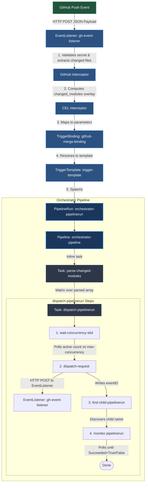
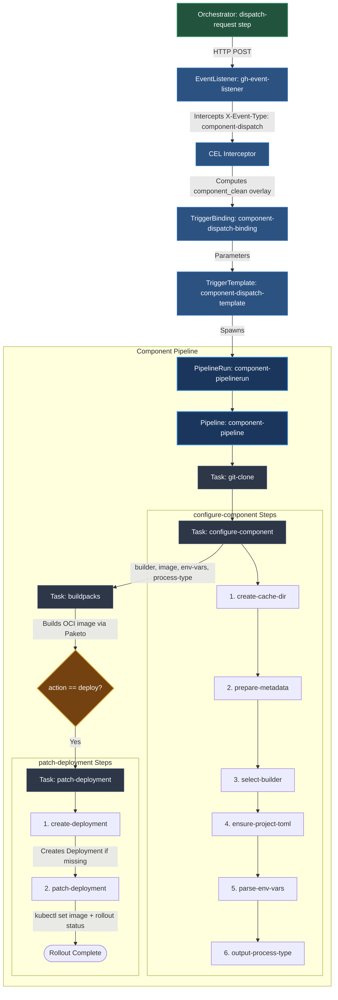

# Tekton CI/CD Platform Infrastructure

This directory contains the Tekton CI/CD pipeline configuration designed to automate concurrency management, dynamic change detection, and building/deploying of components using Cloud Native Buildpacks in a single, unified pipeline.

## Architecture & Directory Structure

*   **`base/`**: Holds RBAC permissions, service accounts, sealed secrets (GitHub authentication, GitHub webhook, and GHCR registry credentials), and triggers webhook service manifests.
*   **`pipelines/`**: Defines the CI/CD pipelines:
    *   `orchestrator-pipeline.yaml`: Entrypoint orchestrator pipeline that runs matrix dispatching for all changed component modules in parallel.
    *   `component-pipeline.yaml`: Builder pipeline that runs for each changed component to clone the repository, configure build variables, build using Cloud Native Buildpacks, and deploy the application.
*   **`tasks/`**: Declares individual Tekton tasks containing their inline script logic:
    *   `parse-changed-modules.yaml`: Parses the list of changed files/paths and outputs a distinct JSON array of changed component modules to build.
    *   `configure-component.yaml`: Dynamically configures building variables (builder image, target image name, environment variables, default process type, etc.) for a specific component and ensures a `project.toml` configuration is present.
    *   `dispatch-pipelinerun.yaml`: Dynamically triggers a child `component-pipeline` PipelineRun with dedicated workspace/cache PVC configurations, managing stagger delays, concurrency checks, and order-based scheduling.
    *   `patch-deployment.yaml`: Patches the target Kubernetes deployment container with the newly built image tag, creating the deployment if it does not exist, and monitors the rollout to completion.
*   **`triggers/`**: Configures EventListeners (`event-listener.yaml`), TriggerBindings (`github-binding.yaml`, `component-dispatch-binding.yaml`), and TriggerTemplates (`trigger-template.yaml`, `component-dispatch-template.yaml`) to process webhook payloads and dispatch orchestrator or component pipelines.
*   **`tests/`**: Contains local test files:
    *   `mock-pipeline-run.sh`: Triggers a mock local orchestrator PipelineRun simulating a GitHub webhook dispatch event.
*   **`scripts/`**: Contains helper utility scripts:
    *   `stop-all-running-pipelinerun.sh`: Cancels/stops all running PipelineRuns in the namespace.


---

#### Pipeline Execution Flow

The platform's execution is divided into two separate stages: the main **Orchestrator Pipeline** and the subsequent **Component Pipelines** triggered for each changed component.

### 1. Orchestrator Pipeline Flow
This stage is triggered on any Git `push` event. It clones the repository, detects which components changed, and triggers a downstream build for each changed module.



### 2. Component Pipeline Flow
This stage runs for each individual changed component. It configures component-specific build variables, packages the app with Paketo buildpacks, and optionally deploys it to the cluster when `action=deploy`.



---

## Prerequisites

1.  **Tekton Pipelines and Triggers** installed in your Kubernetes cluster.
    *   **Install Tekton Pipelines**:
        ```bash
        kubectl apply --filename https://storage.googleapis.com/tekton-releases/pipeline/latest/release.yaml
        ```
        Verify that all components are running:
        ```bash
        kubectl get pods --namespace tekton-pipelines --watch
        ```
    *   **Install Tekton Triggers and Interceptors**:
        ```bash
        kubectl apply --filename https://storage.googleapis.com/tekton-releases/triggers/latest/release.yaml
        kubectl apply --filename https://storage.googleapis.com/tekton-releases/triggers/latest/interceptors.yaml
        ```
        For more details, refer to the [Tekton Getting Started Guide](https://tekton.dev/docs/getting-started/).
2.  **Official `git-clone` task** installed from the Tekton Hub:
    ```bash
    kubectl apply -f https://raw.githubusercontent.com/tektoncd/catalog/main/task/git-clone/0.9/git-clone.yaml
    ```
3.  **Official `buildpacks-phases` task** installed from the Tekton Hub:
    ```bash
    kubectl apply -f https://raw.githubusercontent.com/tektoncd/catalog/refs/heads/main/task/buildpacks-phases/0.3/buildpacks-phases.yaml
    ```
4.  **Sealed Secrets Controller** installed and configured in your Kubernetes cluster:
    *   The platform infrastructure uses `SealedSecrets` (found in the `base/` directory) to safely store and decrypt GitHub credentials and GHCR registry secrets.
    *   **Install Sealed Secrets**:
        ```bash
        kubectl apply -f https://github.com/bitnami-labs/sealed-secrets/releases/download/v0.21.0/controller.yaml
        ```
        For more details and customization options, see the [Sealed Secrets Docs](https://github.com/bitnami-labs/sealed-secrets).
5.  **Configure Tekton Feature Flags**: By default, Tekton's Affinity Assistant restricts task runs to using at most one PVC-based workspace under the default `coschedule: workspaces` mode. Since the component pipeline binds multiple PVCs (for source and cache), you must update the `coschedule` flag to `pipelineruns` in the `feature-flags` ConfigMap under the `tekton-pipelines` namespace:
    ```bash
    kubectl patch cm feature-flags -n tekton-pipelines --type=merge -p '{"data":{"coschedule":"pipelineruns"}}'
    ```

---

## GitHub Webhook Configuration

To trigger pipeline builds automatically when code is pushed to GitHub, you need to configure a GitHub Webhook:

1. **Expose the EventListener (via Cloudflare Tunnel)**:
   * The platform exposes the EventListener via `tekton-platform/base/triggers-webhook-service.yaml`, which forwards requests from the `default` namespace to the actual `el-gh-event-listener` running in the `saritasa-test` namespace using an `ExternalName` service:
     ```yaml
     apiVersion: v1
     kind: Service
     metadata:
       name: gh-listener-webhook
       namespace: default
     spec:
       type: ExternalName
       externalName: el-gh-event-listener.saritasa-test.svc.cluster.local
     ```
   * Expose this forwarded `gh-listener-webhook` service (running on port `8080` in the `default` namespace) to the internet by routing it through your **Cloudflare Tunnel** (`cloudflared`) pointing to `http://gh-listener-webhook.default.svc.cluster.local:8080`.
2. **Configure the Webhook on GitHub**:
   * Go to your repository on GitHub -> **Settings** -> **Webhooks** -> **Add webhook**.
   * **Payload URL**: Enter your exposed public URL (e.g., `https://<your-cloudflare-tunnel-domain>`).
   * **Content type**: Select `application/json`.
   * **Secret**: Enter the webhook secret token matching the value configured in your Kubernetes `github-webhook-secret` (defined under the `token` key).
   * **Which events**: Select **Just the push event** (the EventListener is configured to trigger on any Git `push` event, rather than pull requests).
   * Click **Add webhook** to register it.

---

## Installation & Deployment

Deploy all platform resources (RBAC, Secrets, Tasks, Pipelines, and Triggers) in a single step using Kustomize:

```bash
kubectl apply -k tekton-platform/
```


## Adding/Modifying Component Builds

Build configurations are maintained directly inside the component directories:
1.  **Component Detection**: Any subdirectory (excluding platform/infrastructure folders like `tekton-platform`, `kubernetes`, `tests`, etc.) is automatically registered as a buildpack-ready component.
2.  **Build Customization**: To customize builder images, environment variables, or buildpacks for a component, define a `project.toml` file in its component directory containing `[[build.env]]` and `[[build.buildpacks]]` blocks. If no `project.toml` is present, a default one will be automatically generated at build time using the detected technology stack.


